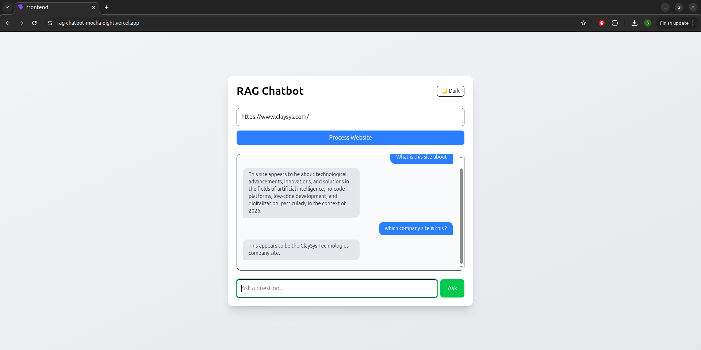
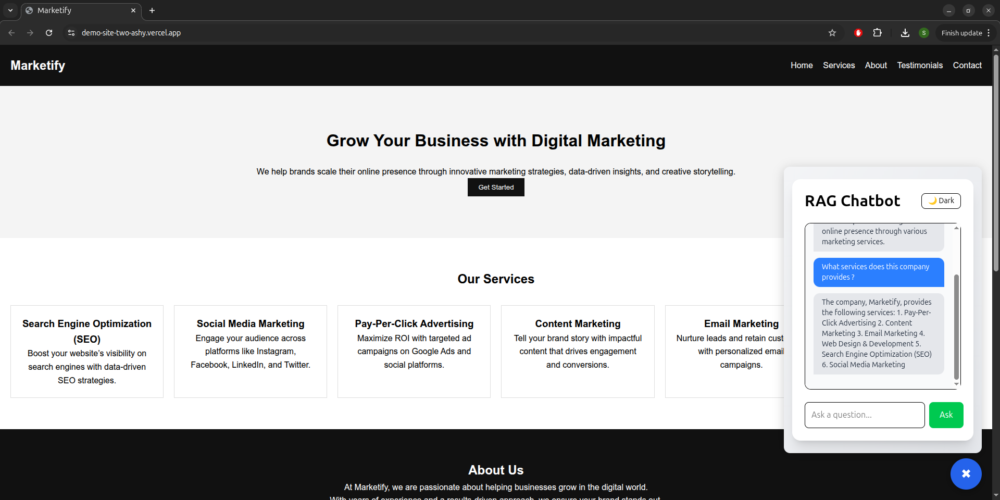

# 🚀 RAG-Powered Website Chatbot with Embeddable Widget

## 📌 Overview

This project is a **production-ready RAG (Retrieval-Augmented Generation) chatbot** that transforms any website into an intelligent, queryable assistant.

Users can:

* Enter a website URL
* Process its content into a knowledge base
* Ask natural language questions
* Receive accurate, context-aware answers

The system also supports a **plug-and-play embeddable chatbot widget**, allowing integration into any website using a single script tag.

---

## ✨ Key Features

* 🌐 Convert any website into a chatbot
* 🧠 Context-aware question answering using RAG
* ⚡ Fast AI responses powered by Groq
* 📦 Efficient semantic search using FAISS
* 💬 Clean and interactive chat interface
* 🧩 Embeddable chatbot for external websites

---

## 🏗️ Tech Stack

### Backend

* FastAPI
* BeautifulSoup + Requests (Web scraping)
* FAISS (Vector search)
* Groq API (`llama-3.1-8b-instant`)
* Gemini API (for embeddings)

### Frontend

* React (Vite)
* Tailwind CSS

### Deployment

* Backend: Render
* Frontend: Vercel

---

## ⚙️ How It Works

### 1. Website Processing Pipeline

```
URL → Scrape → Clean → Chunk → Vectorize → Store in FAISS
```

* Extracts visible content from the website
* Cleans and normalizes text
* Splits into smaller chunks
* Converts into vector representations
* Stores in FAISS for fast retrieval

---

### 2. Question Answering (RAG Flow)

```
User Query → Vectorize → Retrieve Relevant Chunks → Generate Answer
```

* User question is converted into a vector
* Relevant content is retrieved from FAISS
* Context is passed to the LLM
* Final answer is generated using Groq

---

## 🔄 System Architecture

```
Frontend (React UI)
        ↓
FastAPI Backend
        ↓
Scraper → Text Processing → Vector Store (FAISS)
        ↓
Retriever → Prompt Builder → Groq LLM
        ↓
Response + Context
```

---

## 🔌 API Endpoints

### Process Website

```
POST /process?url=...
```

### Ask Question

```
GET /ask?query=...
```

---

## 🧩 Embeddable Chatbot

You can integrate the chatbot into any website using:

```html
<script src="https://your-domain.com/embed.js"></script>
```

This injects a floating chatbot widget that connects to your backend.

---

## 🚀 Getting Started

### Backend

```bash
cd backend
pip install -r requirements.txt
uvicorn app.main:app --reload
```

### Frontend

```bash
cd frontend
npm install
npm run dev
```

---

## 🔐 Environment Variables

Create a `.env` file:

```
GROQ_API_KEY=your_key
GEMINI_API_KEY=your_key
```

---

## 📸 Demo Flow

1. Enter a website URL
2. Process the website
3. Ask questions
4. Get contextual answers
5. Embed chatbot into any website

---

## 📸 Demo

### 🔹 Standalone Chatbot (Manual URL Input)

This mode allows users to input any website URL and interact with it through the chatbot.

* User provides a URL
* System processes the website
* Questions can be asked interactively



---

### 🔹 Embedded Chatbot (Automatic Website Context)

In this mode, the chatbot is embedded directly into a website using a script.

* No manual URL input required
* Automatically processes the current website
* Acts as an on-site AI assistant



---

### 💡 Key Difference

| Mode       | Input Required | Use Case                                   |
| ---------- | -------------- | ------------------------------------------ |
| Standalone | Manual URL     | Analyze any website                        |
| Embedded   | Automatic      | Enhance your own website with AI assistant |

---

## 🏁 Conclusion

This project demonstrates a **real-world AI system** that combines:

* Retrieval (FAISS)
* Language understanding (LLM)
* Web data processing
* Full-stack integration

It showcases how modern AI applications can be built efficiently using free tools while maintaining production-level architecture.

---

## 📜 License

MIT License
